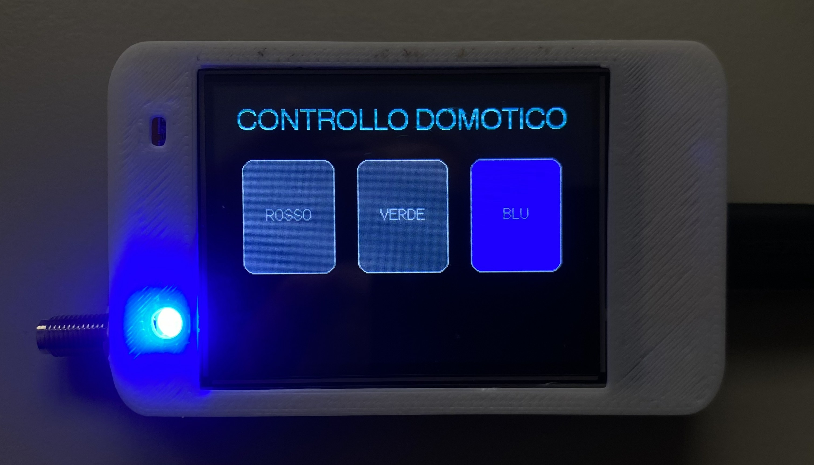
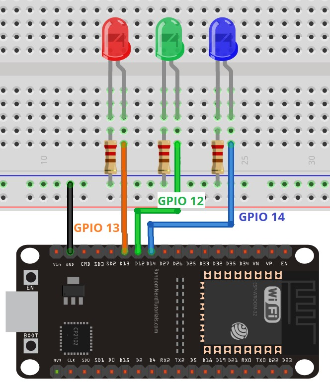

# Controllo Domotico Wireless con ESP-NOW

Questo repository contiene la documentazione e il codice sorgente del mio progetto per la materia di Sistemi e Reti / Automazione. Ho realizzato un sistema per il controllo remoto di carichi fisici (simulati tramite 3 LED) utilizzando due microcontrollori della famiglia ESP32.

La caratteristica principale del progetto è l'utilizzo del protocollo ESP-NOW. Questo permette alle due schede di comunicare in modo diretto (Peer-to-Peer) senza appoggiarsi al router Wi-Fi locale. I vantaggi sono un'estrema velocità di risposta ai comandi e la totale indipendenza dall'infrastruttura di rete dell'edificio.

##  Schema a blocchi dell'architettura

Il sistema si basa su un'architettura logica Master/Slave. Nello schema seguente è illustrato il flusso dei dati:


##  Hardware e Schema Elettrico

L'hardware è stato suddiviso in due unità distinte:

**Nodo Master (HMI):**
Ho utilizzato una scheda ESP32-2432S024R, comunemente chiamata "Cheap Yellow Display" (CYD). Essendo dotata di un display TFT da 2.8 pollici e di un pannello touch resistivo integrati direttamente sul PCB, non è stato necessario realizzare cablaggi esterni su breadboard.

**Nodo Slave (Attuatori):**
Ho utilizzato un classico ESP32 DevKit V1 montato su breadboard. I carichi fisici sono simulati tramite tre LED colorati. Tutti i catodi dei LED sono stati chiusi in comune sul pin GND dell'ESP32. Gli anodi sono stati collegati secondo la seguente tabella:

| Carico Simulato | Pin ESP32 (GPIO) | Collegamento in serie |
| :--- | :--- | :--- |
| Luce Rossa | Pin 13 | GPIO 13 -> Resistenza 220 ohm -> LED |
| Luce Verde | Pin 12 | GPIO 12 -> Resistenza 220 ohm -> LED |
| Luce Blu | Pin 14 | GPIO 14 -> Resistenza 220 ohm -> LED |

##  Il Protocollo Radio e la Struttura Dati

Per garantire che il Master riesca sempre a trasmettere i comandi senza dover specificare l'indirizzo MAC esatto del ricevitore, ho configurato l'invio in modalità Broadcast (indirizzo universale `FF:FF:FF:FF:FF:FF`). 

I dati viaggiano all'interno di una struttura in C++ (struct) che deve essere dichiarata in modo identico su entrambi i dispositivi:

```cpp
typedef struct struct_message {
  bool red;   // Stato del carico rosso
  bool green; // Stato del carico verde
  bool blue;  // Stato del carico blu
} struct_message;
```
Questa struttura pesa solamente 3 byte. Questo rende il pacchetto dati estremamente leggero, abbassando i tempi di latenza a pochi millisecondi.

##  Logica di funzionamento Software

**Codice del Master (CYD):**
Il software disegna l'interfaccia a 3 pulsanti e scansiona ciclicamente lo schermo in attesa di un tocco. Quando rileva una pressione valida (superato un delay di anti-rimbalzo di 300ms per evitare letture doppie), inverte lo stato booleano della variabile associata a quel pulsante, aggiorna il colore sullo schermo e richiama la funzione per trasmettere il pacchetto radio.

**Codice dello Slave:**
Il ricevitore funziona ad eventi tramite Interrupt. Il ciclo principale è vuoto per risparmiare risorse. Quando l'antenna dell'ESP32 riceve il pacchetto dal Master, si innesca automaticamente una funzione di Callback. Il software estrae i tre valori ricevuti e li applica immediatamente ai pin 12, 13 e 14 tramite l'istruzione `digitalWrite()`.

## Problemi affrontati (Troubleshooting)

Durante i primi collaudi, ho notato che il Monitor Seriale del Master confermava l'invio dei pacchetti, ma lo Slave non riceveva i dati e i LED rimanevano spenti.

Analizzando il problema, ho riscontrato che i moduli ESP32 salvano in cache l'ultimo canale Wi-Fi a cui si sono connessi. Se in passato le due schede erano state collegate a reti diverse, cercavano di comunicare su frequenze diverse, rendendo impossibile l'accoppiamento.
Ho risolto il problema forzando un allineamento dei canali radio tramite l'inserimento di questa direttiva nel `setup()` di entrambi i codici:

```cpp
WiFi.mode(WIFI_STA);
WiFi.disconnect(); 
```
Il comando di disconnessione pulisce la memoria della scheda e permette al protocollo ESP-NOW di funzionare correttamente sul canale di base.


## Foto del progetto

Qui sotto sono riportate le immagini del sistema in funzione.



##  Fonti e Sitografia
Per lo studio iniziale del protocollo ESP-NOW e la stesura della struttura di base del codice di trasmissione, ho fatto riferimento alla seguente guida tecnica, che ho poi riadattato e fuso con le librerie grafiche per lo schermo touch:
* **Random Nerd Tutorials:** [Getting Started with ESP-NOW (ESP32 with Arduino IDE)](https://randomnerdtutorials.com/esp-now-esp32-arduino-ide/)

##  Conclusioni
Il progetto ha dimostrato l'efficienza della comunicazione Peer-to-Peer per applicazioni di automazione in tempo reale. Il ritardo tra la pressione del display e l'accensione del LED è impercettibile. In futuro, il circuito ricevente potrebbe essere potenziato sostituendo i LED di segnalazione con una scheda a relè, permettendo così il controllo di carichi reali a 220V AC (come lampadine, elettrovalvole o motori).

---
*Progetto sviluppato da  Anas - Classe 4ª Automazione*
